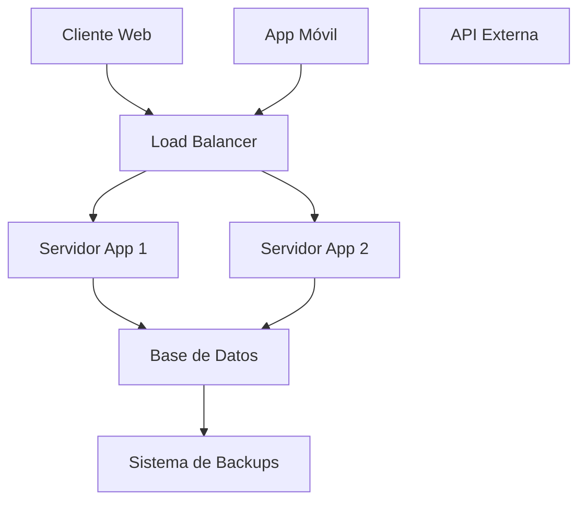

# :clipboard: Sistema de Gestión Escolar - COTARELOManage

> Un sistema completo para la gestion de centros educativos modernos

### 🎯 Descripcion general

**cotareloManage** es una plataforma *innovadora* para **facilitar** la administracion de instituciones educativas. Combina tecnolog'ia avanzada con una interfaz *intuitiva* para optimizar los procesos academicos y administrativos

### :star: caracteristicas principales

- **gestion de estudiantes** y profesorado
- *dashboard* interactico con metricas en tiempo real 
- sistema de **califacaciones** automatizado 
-  sistema de calificaciones entre *padres*, estudiantes y docentes
- Reportes **personalizables**

## 📊 Estadisticas del proyecto
| Metrica | valor | estado |
| ------- | ----- | ------ |
| usuarios activos | 15.247 | ✅ activo |
| colegios registrados | 342 | 📈 Creciendo |
| Uptime | 99.9% | 🟢 Excelente |
| Satisfaccion | 4.8/5 | ⭐ Muy alta |

## 🏗️ Arquitectura del sistema

## 📈 Crecimiento de usuarios
La ecuacion que modela nuestro crecimiento es:

 $U(t) = U_0 * e^(rt)$

 Donde:
 - *U(t)* = usuarios en el tiempo *t*
 - *U^0* = usuarios iniciales (500)
 - *r* = tasa de crecimiento (0.15 mensual)
 - *t* = tiempo en meses

   El **ROI** (return of investment) se calcula como $ROI = \frac{Beneficio - Inversión}{Inversión} \times 100$

## 🔧 Tecnologías Utilizadas
### FrontEnd

- **React,js** v18.2.0
- *Material-UI para componentes
- **TypeScript** para tipado est'atico

### Backend
- *Node.js* con Express
- **MongoDB** como base de datos
- *JWT* para autenticacion
## 📝 Lista de Tareas Pendientes
- [x] Implementar sistema de login
- [x] Crear dashboard principal
- [ ] añadir modulo de **calificaciones**
- [ ] integrar sistema de *notificaciones*
- [ ] desarrollar app movil
- [ ] Implementar **analytics** avanzados

## 🤝 Contribuir al Proyecto
¿Quieres ayudar? ¡Genial! Sigue estos pasos:
1. Haz un *fork* del repositorio
2. Crea una rama para tu **feature*: git checkout -b nueva-funcionalidad
3. realiza tus *cambios* y haz commit
4. envia un **pull request**

## 📧 Contacto y Soporte
- **Email: soporte@CotareloManage.es
- **Slack**: [Únete a nuestro workspace](https://cotarelomanage.slack.com/)
- **Documentacion**: docs.cotareloManage.es

## 📜 Licencia
Este proyecto está bajo licencia **MIT**. consulta el archivo 
